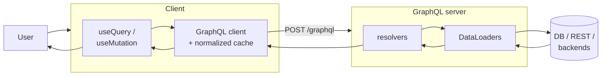
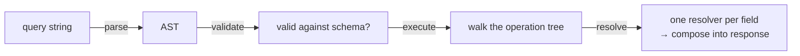
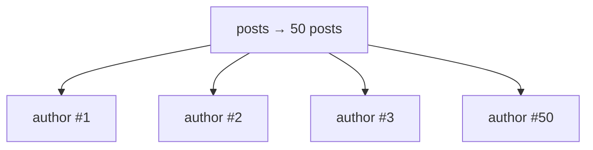
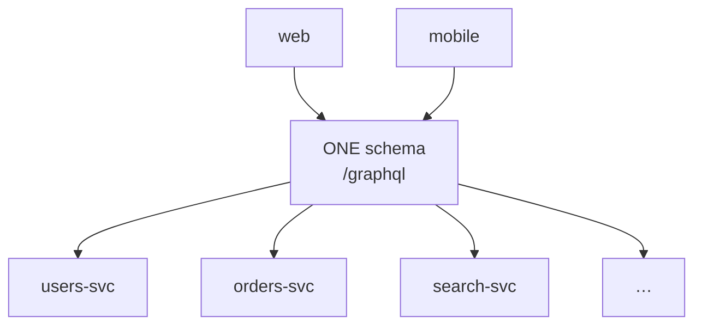

# GraphQL
## A Practical Introduction

<div class="muted" style="margin-top:1.2rem">
the type system &nbsp;•&nbsp; resolvers &amp; DataLoader &nbsp;•&nbsp; schema design &nbsp;•&nbsp; the client &nbsp;•&nbsp; how to ship
</div>

<div style="margin-top:2.5rem" class="muted text-sm">
Answer the <span class="tag">LIVE QUESTION</span> after each section — press <kbd>→</kbd> to begin
</div>

<!--
Practical intro. Pattern per section: learn the concept, see a runnable example,
then the room answers a live question. Vendor-neutral; examples are realistic but generic.
-->

---
layout: center
---

# What you'll walk away with

<div class="col-2" style="margin-top:1.5rem; text-align:left">
<div class="card">

### Read & write
Read any SDL schema, write queries / mutations / fragments, and reason about what comes back.

</div>
<div class="card">

### Build & ship
Understand resolvers, the N+1 trap, schema-design conventions, the client cache, and how a change flows end-to-end.

</div>
</div>

<div class="muted text-sm" style="margin-top:1.5rem">
Each idea comes with a runnable example and a live question. By the end you can confidently start working on a GraphQL codebase — server or client.
</div>

---
layout: center
class: text-center
---

# Join the quiz <span style="font-size:0.8em">🏆</span>

<div class="muted" style="margin-bottom:1.6rem">answer the live questions after each section — top 3 win a prize at the end</div>

<JoinGate />

---
layout: center
---

# The shape of a GraphQL system



<div class="muted text-sm" style="margin-top:0.5rem">
One typed endpoint in. The server resolves exactly the fields requested from whatever backends it has, and returns that precise shape.
</div>

---
layout: section
---

# Fundamentals
<div class="muted">the type system, the single endpoint, why it beats N REST calls</div>

---

# The 60-second mental model

<div class="col-2">
<div>

GraphQL is a **query language + a server runtime** for APIs.

- The **schema is the contract** — written in SDL, strongly typed. Validation + tooling come for free.
- The client **declares the exact shape** it wants; the server returns **precisely that** — no more, no less.
- **Transport- and database-agnostic.** It sits on top of any backend (REST, DB, microservices).

</div>
<div>

<div class="card">

<div class="mm-head">It is <strong>NOT</strong></div>
<div class="mm-row"><span class="mm-ic bad">✕</span> a database</div>
<div class="mm-row"><span class="mm-ic bad">✕</span> a graph database <span class="muted">(no relation to Neo4j)</span></div>
<div class="mm-row"><span class="mm-ic bad">✕</span> tied to any language or storage</div>

<div class="mm-head" style="margin-top:0.9rem">It <strong>IS</strong></div>
<div class="mm-row"><span class="mm-ic good">✓</span> a spec + a runtime</div>
<div class="mm-row"><span class="mm-ic good">✓</span> one typed schema, one endpoint</div>
<div class="mm-row"><span class="mm-ic good">✓</span> an API layer over what you already have</div>

</div>
</div>
</div>

<!--
The most common misconception: "graph" makes people think graph DB. Kill it early.
It is an API layer in front of whatever backends you already have.
-->

---

# The REST pains it solves

<div class="col-2">
<div>

**Over-fetching** — the endpoint returns far more than the screen needs.

**Under-fetching** — you need N calls to assemble one screen (the request *waterfall*).

</div>
<div>

```bash
# REST: a waterfall of round trips
GET /users/42            # over-fetch: tons of unused fields
GET /users/42/posts      # [{id,title}, ...]
GET /posts/101/comments  # ...
GET /posts/102/comments  # ...
```

</div>
</div>

```graphql
# GraphQL: ONE request, exactly the fields needed, fully nested
query {
  user(id: "42") {
    name
    posts { title comments { text } }
  }
}
```

<div class="muted text-sm">4 dependent REST calls collapse into a single tailored query. This is the core win.</div>

---

# SDL is the contract

```graphql {all|1-5|7-13|12|10}
enum Role {
  ADMIN
  EDITOR
  VIEWER
}

type User {
  id: ID!            # ! = non-null
  name: String!
  email: String      # nullable
  role: Role!
  posts(limit: Int = 10): [Post!]!   # [..] = list, with a field argument + default
}
```

<v-click>

**Scalars** (`Int Float String Boolean ID` + custom) · **object types** · **enums** · **interfaces** · **unions** · **input types**. <br/>`!` = non-null, `[]` = list — so `[Post!]!` is a non-null list of non-null Posts.

</v-click>

---

# Query == response shape

<div class="col-2">
<div>
<div class="src">// what the client sends</div>

```graphql {all|3-9}
query GetUser {
  user(id: "42") {
    name
    role
    posts(limit: 2) {
      title
    }
  }
}
```
</div>
<div>
<div class="src">// what comes back — identical tree</div>

```json {all|3-11}
{
  "data": {
    "user": {
      "name": "Ada Lovelace",
      "role": "EDITOR",
      "posts": [
        { "title": "On the Analytical Engine" },
        { "title": "Notes on Bernoulli Numbers" }
      ]
    }
  }
}
```
</div>
</div>

<div class="muted text-sm">No <code>email</code>, no <code>id</code>, no <code>body</code> — they were never requested, so they are absent. <strong>No over-fetch, by construction.</strong></div>

---

# Three root operation types

```graphql {all|1-4|6-12|14-16}
type Query {            # READ — fields run in PARALLEL
  user(id: ID!): User
  posts: [Post!]!
}

input CreatePostInput {        # input types: arguments only, never output types
  title: String!
  body: String!
  authorId: ID!
}
type Mutation {                # WRITE — top-level fields run SERIALLY, in order
  createPost(input: CreatePostInput!): Post!
}

type Subscription {            # STREAM — long-lived, over SSE/WebSocket
  postAdded: Post!
}
```

<div class="muted text-sm"><strong>Query</strong> fields resolve in parallel; <strong>mutation</strong> fields resolve one-by-one top to bottom. Don't rely on ordering between query fields.</div>

---

# One endpoint. HTTP 200 even on errors.

```bash {all|1-7|8}
curl -X POST https://api.example.com/graphql \
  -H 'Content-Type: application/json' \
  -d '{
    "query": "query($id: ID!) { user(id: $id) { name role } }",
    "variables": { "id": "42" }
  }'
# -> HTTP 200,  body: { "data": {...}, "errors": [...] }
```

<div class="col-2" style="margin-top:1rem">
<div class="card">

🔑 The whole API is **one POST URL**. Variables travel **separately** from the query string.

</div>
<div class="card">

⚠️ Status is usually **200 even when a field errors**. Always check the **`errors[]`** array — `data` can be partially present.

</div>
</div>

---

# Interfaces vs unions

```graphql {all|1-5|7|9-15}
interface Node {       # interface = SHARED fields across types
  id: ID!
}
type User implements Node { id: ID!  name: String! }
type Post implements Node { id: ID!  title: String! }

union SearchResult = User | Post   # union = one-of, NO shared fields required

query {
  search(term: "ada") {
    ... on User { name }    # inline fragment: pick fields per concrete type
    ... on Post { title }
    __typename              # reveals the runtime type
  }
}
```

<div class="muted text-sm">Use an <strong>interface</strong> when types share queryable fields; a <strong>union</strong> when they are just a one-of with nothing in common. The server picks the concrete type via a <code>__resolveType</code> function.</div>

---

# Introspection powers the tooling

<div class="col-2">
<div>

The schema can describe **itself** at runtime via `__schema` / `__type`.

This is what powers:
- autocomplete in **GraphiQL / Apollo Sandbox**
- the live **docs panel**
- client **codegen** (typed operations)

</div>
<div>

```graphql
query IntrospectTheSchema {
  __schema {
    queryType { name }
    types {
      name
      kind   # OBJECT | SCALAR | ENUM
             # INTERFACE | UNION | INPUT_OBJECT
      fields { name }
    }
  }
}
```

</div>
</div>

<div class="muted text-sm">Common production hardening: gate or disable introspection so the full schema / attack surface isn't exposed publicly.</div>

---
layout: center
---

# 🔴 Try it yourself

## Open a GraphQL IDE

<div style="text-align:left; max-width:42rem; margin:1.5rem auto">

```graphql
# In GraphiQL / Apollo Sandbox, run a real query:
query {
  user(id: "42") { name role posts(limit: 2) { title } }
}
```

</div>

<div class="muted">Watch <code>data</code> mirror your selection set · browse the docs panel (that's introspection) · add a bogus field → <code>GRAPHQL_VALIDATION_FAILED</code> <em>before</em> anything executes.</div>

---
layout: center
class: text-center
---

<div class="q-title"><span class="tag tag-live">LIVE&nbsp;QUESTION</span><span class="q-title-text">Fundamentals</span></div>

<div style="max-width:46rem; margin:1.5rem auto; text-align:left">

<Quiz
  qid="q1-fundamentals-shape"
  question="A client asks ONLY for a user's name and email. The User type also has id, role, and posts. What's in the response data?"
  :options="[
    'The full User object with all fields',
    'Only name and email',
    'name, email, plus id (always auto-included)',
    'An error — you must request all non-null fields',
  ]"
  :answer="1"
  explanation="GraphQL returns exactly the fields requested — nothing more. That is precisely how it kills over-fetching. <code>id</code> is never auto-included; you may freely omit non-null fields you do not need."
/>

</div>

---
layout: center
class: text-center
---

<div class="q-title"><span class="tag tag-live">LIVE&nbsp;QUESTION</span><span class="q-title-text">The lifecycle</span></div>

<div style="max-width:46rem; margin:1.5rem auto; text-align:left">

<Quiz
  qid="q2-lifecycle-order"
  question="What is the correct order of the server-side GraphQL request lifecycle?"
  :options="[
    'validate → parse → resolve → execute',
    'parse → validate → execute → resolve',
    'execute → parse → resolve → validate',
    'resolve → execute → validate → parse',
  ]"
  :answer="1"
  explanation="The server <strong>parses</strong> the query string into an AST, <strong>validates</strong> it against the schema, then <strong>executes</strong> the operation — calling a <strong>resolver</strong> for each field to produce its value — which is exactly what we dig into next."
/>

</div>

---
layout: section
---

# Resolvers & DataLoader
<div class="muted">how fields get their values — and the N+1 trap every team hits</div>

---

# Server-side request lifecycle



<div class="col-2" style="margin-top:1rem">
<div class="card">

A **resolver** is a function returning one field's value:

```ts
(parent, args, context, info) => value
```

</div>
<div class="card">

Resolvers **compose into a tree**: a field's return value becomes the **`parent`** of its child resolvers.

</div>
</div>

---

# The four resolver arguments

```ts {all|2|3|4|5}
function resolver(parent, args, context, info) {
  // parent  = the resolved value one level up (your input)
  // args    = the GraphQL field arguments
  // context = per-request shared state (auth user, loaders, db handles, logger)
  // info    = resolution AST / metadata (rarely needed)
  return value
}
```

<div class="col-2" style="margin-top:0.8rem">
<div class="card">

If you **don't** write a field resolver, the default one just returns `parent[fieldName]`.

</div>
<div class="card">

A useful pattern: **return `parent.field` if already present**, otherwise fetch it. Cheap when the parent already hydrated it.

</div>
</div>

<div class="muted text-sm">A non-null field that resolves to <code>null</code> makes the server throw — and the error <em>propagates up</em>, nulling the parent. Nullability is a real design decision.</div>

---

# Resolvers compose into a tree

<div class="col-2">
<div>

```graphql
query {
  post(id: "101") {   # Query.post
    title             #   Post.title
    author {          #   Post.author
      name            #     User.name
    }
  }
}
```

</div>
<div>

```ts
const resolvers = {
  Query: {
    post: (_p, args, ctx) => ctx.db.post(args.id),
  },
  Post: {
    // parent = the post returned above
    author: (post, _a, ctx) => ctx.db.user(post.authorId),
  },
}
```

</div>
</div>

<div class="muted text-sm">Each field's return value becomes the <code>parent</code> of its children. Resolution walks <strong>down</strong> the tree, one resolver per field.</div>

---

# The N+1 problem

<div class="col-2">
<div>

A list of **N** posts; each `Post.author` resolver fetches its user.

**Naive:** 1 query for the list **+ N** queries for the authors → **N+1** round trips.

</div>
<div>



</div>
</div>

```ts
// ❌ N+1: one DB/REST call PER post
Post: { author: (post, _a, ctx) => ctx.db.user(post.authorId) }
```

<div class="bad text-sm">50 posts on a screen → 51 backend calls. This is the single most common GraphQL performance bug.</div>

---

# DataLoader: batch + cache per request

<div class="col-2">
<div>

A **DataLoader** collects every `.load(key)` call in a tick, hands them to **one** batch function, and caches by key **within the request**.

```ts
const userLoader = new DataLoader(
  async (ids) => {
    const users = await db.usersByIds(ids) // ONE call
    return ids.map(id => users[id])
  }
)
```

</div>
<div>

```ts {all|3}
// ✅ N+1 gone: 50 .load() calls -> 1 batched fetch
Post: {
  author: (post, _a, ctx) =>
    ctx.loaders.user.load(post.authorId),
}
```

<div class="card" style="margin-top:0.6rem">

**Batch** — coalesce a tick's loads into one call.
**Cache** — dedupe identical keys in the request.

</div>
</div>
</div>

<div class="bad text-sm">⚠️ Build loaders <strong>per request</strong> (never module-global) — a shared cache would leak one user's data into another's. And <code>await</code>-in-a-loop defeats batching.</div>

---

# Two patterns that keep loaders sane

<div class="col-2">
<div>

### Stable keys
The batch function must return results **in the same order** as the keys it received — map keys → results explicitly.

```ts
return ids.map(id => byId[id] ?? null)
```

</div>
<div>

### Resilient batches
Use `Promise.allSettled` so **one** failed key doesn't fail the whole list — return an error value for that key only (a **partial response**).

```ts
const settled = await Promise.allSettled(
  keys.map(k => fetchOne(k)),
)
```

</div>
</div>

<div class="muted text-sm">In a gateway over many backends, partial responses are essential: a 200 with most of <code>data</code> + one entry in <code>errors[]</code> beats failing the entire query.</div>

---
layout: center
class: text-center
---

<div class="q-title"><span class="tag tag-live">LIVE&nbsp;QUESTION</span><span class="q-title-text">Spot the N+1</span></div>

<div style="max-width:48rem; margin:1.2rem auto; text-align:left">

<Quiz
  qid="q3-n-plus-1"
  question="A query returns 50 posts, and each Post.author resolver fetches its user. Awaiting the fetch per post is slow. What fixes it?"
  :options="[
    'Add an index to the users table and call it a day',
    'Batch the 50 author fetches into one call with a per-request DataLoader',
    'Mark the author field non-null so it resolves faster',
    'Move the author fetch into the Query.posts resolver',
  ]"
  :answer="1"
  explanation="This is the N+1 problem: 1 list query + 50 author fetches. A <strong>DataLoader</strong> coalesces the 50 <code>.load()</code> calls in a tick into a single batched fetch and dedupes by key within the request."
/>

</div>

---
layout: section
---

# Schema design
<div class="muted">the conventions that keep a large schema healthy</div>

---

# Nullability is a contract + precise scalars

<div class="col-2">
<div>

- Mark `!` **only** when the data **truly cannot** be null.
- If a backend *might* return null → keep it **nullable**, so clients never crash on "guaranteed" data.
- Use **precise custom scalars** over `String`/`Int`.

</div>
<div>

```graphql
scalar DateTime        # RFC 3339 UTC
scalar EmailAddress
  @specifiedBy(url: "https://html.spec…")
scalar URL
scalar NonEmptyString
scalar NonNegativeInt  # for pagination `first`
scalar SafeInt         # numbers > Int32
```

</div>
</div>

<div class="bad text-sm" style="margin-top:0.5rem">⚠️ Over-non-nulling is dangerous: a non-null field that resolves to <code>null</code> <strong>nulls out its entire parent object</strong> (error propagation).</div>

---

# Naming rules

<div class="col-2">
<div>

**Types** — UpperCamelCase, domain-specific.

```graphql
# ❌ collides in a large schema
type Session { ... }
# ✅ specific
type CheckoutSession { ... }
```

**Enums** — CAPITAL_CASE values, no `Enum` suffix.

```graphql
enum OrderStatus { ACTIVE SHIPPED }
```

</div>
<div>

**Fields** — no `get`/`list` prefixes; camelCase, no leaky snake_case.

```graphql
extend type Query {
  user(id: ID!): User    # not getUser
  users: [User!]!        # not listUsers
}
# modified_at -> updatedAt
```

<div class="muted text-sm">Field names are part of the public contract — make them describe the data, not the transport.</div>

</div>
</div>

---

# Paginate everything — use cursors

<div class="col-2">
<div>

Never return an **unbounded list** (`users: [User!]!`) — one client can pull the whole table.

**Offset/limit** breaks under concurrent writes (skips/duplicates rows) and is slow at depth.

**Cursor-based (Relay Connection)** is stable and the industry default.

</div>
<div>

```graphql
type PostEdge { cursor: String  node: Post! }

type PostConnection {
  edges: [PostEdge!]!
  pageInfo: PageInfo!
  totalCount: Int          # nullable: backend may not count
}

type PageInfo {
  endCursor: String
  hasNextPage: Boolean!
}

extend type Query {
  posts(first: NonNegativeInt, after: String): PostConnection!
}
```

</div>
</div>

<div class="bad text-sm">⚠️ <code>after</code>/<code>first</code> with a cursor is stable under concurrent inserts/deletes; <code>offset</code> is not.</div>

---

# Mutation responses + errors-as-data

<div class="col-2">
<div>

Return a **wrapper**, never the bare type — so you can add fields later without a breaking change.

```graphql
type CreatePostResponse {
  value: Post          # null on failure
  errors: [Error!]!
}
```

</div>
<div>

**Expected** failures are modeled as **data** (a typed union), not thrown into `errors[]`.

```graphql
interface Error { code: String!  message: String! }

type NameInUse   implements Error { code: String! message: String! }
type NameTooLong implements Error { code: String! message: String! }

union CreatePostError = NameInUse | NameTooLong

type CreatePostResponse {
  value: Post
  errors: [CreatePostError!]!
}
```

</div>
</div>

<div class="muted text-sm">Client switches on <code>__typename</code> instead of string-matching messages. The transport <code>errors[]</code> stays for the <em>unexpected</em>.</div>

---

# Versioning by deprecation — never /v2

<div class="col-2">
<div>

GraphQL evolves **additively**. There is no `/v2` endpoint.

1. Add the new field.
2. Mark the old one `@deprecated` with a **dated** removal plan.
3. Watch usage telemetry, then remove.

</div>
<div>

```graphql
type Post {
  updatedAt: DateTime!
  modifiedAt: DateTime!
    @deprecated(reason:
      "use `updatedAt` instead [2025-06-21]")

  publicName: String
    @deprecated(reason:
      "use `name` instead [2025-01-05]")
}
```

</div>
</div>

<div class="muted text-sm">A parallel <code>/v2</code> schema fragments the graph and doubles maintenance. Deprecate in place.</div>

---
layout: center
class: text-center
---

<div class="q-title"><span class="tag tag-live">LIVE&nbsp;QUESTION</span><span class="q-title-text">Review this schema</span></div>

<div style="max-width:48rem; margin:1rem auto; text-align:left">

<Quiz
  qid="q4-nullability"
  question="A backend sometimes returns null for a user's email. How should the field be typed?"
  :options="[
    'email: EmailAddress!  (non-null — email is conceptually required)',
    'email: EmailAddress   (nullable custom scalar)',
    'email: String         (nullable plain string)',
    'email: String!        (non-null plain string)',
  ]"
  :answer="1"
  explanation="Two rules combine: (1) nullability follows the <strong>backend guarantee</strong> — since it may return null it must be nullable, or the server throws and nulls the parent; (2) use the <strong>precise <code>EmailAddress</code></strong> scalar, not <code>String</code>."
/>

</div>

---
layout: center
class: text-center
---

<div class="q-title"><span class="tag tag-live">LIVE&nbsp;QUESTION</span><span class="q-title-text">Pagination</span></div>

<div style="max-width:48rem; margin:1rem auto; text-align:left">

<Quiz
  qid="q5-pagination"
  question="Which pagination shape should a new query returning a list of files use?"
  :options="[
    'files(limit: Int, offset: Int): [File!]!',
    'files(first: NonNegativeInt, after: String): FileConnection!',
    'files(page: Int, perPage: Int): [File!]!',
    'files: [File!]!',
  ]"
  :answer="1"
  explanation="Use a cursor-based <strong>Connection</strong> with <code>first</code>/<code>after</code>. Offset/limit skips or duplicates rows under concurrent writes and is slow at depth; an unbounded list lets one client pull everything."
/>

</div>

---
layout: section
---

# Production concerns
<div class="muted">the gateway pattern, security, errors, subscriptions</div>

---

# GraphQL as a Backend-for-Frontend

<div class="col-2">
<div>

A common production shape: GraphQL is a **gateway / BFF** in front of existing REST microservices.

The gateway is the right place to centralize:
- **batching** (DataLoader)
- **auth** normalization
- **error** normalization
- **query-cost** limiting
- access control

</div>
<div>



</div>
</div>

<div class="muted text-sm" style="margin-top:0.5rem">
Clients hit <strong>one</strong> typed endpoint; the gateway fans out to many backends so each client team doesn't reinvent batching, auth, and error handling. Often the schema is assembled from per-domain modules (<strong>schema stitching</strong>) or independently-deployed subgraphs (<strong>federation</strong>).
</div>

---

# Codegen: types from the schema

<div class="col-2">
<div>

The schema is machine-readable, so **generate** types instead of hand-writing them.

- **Server** — generate **resolver types** so `(parent, args, context, info)` is fully typed against the schema.
- **Client** — generate **typed operations** so `useQuery(DOC)` infers result + variable types.

</div>
<div>

```ts
// client: a typed document
const GET_USER = graphql(`
  query GetUser($id: ID!) {
    user(id: $id) { id name }
  }
`)
type Data = ResultOf<typeof GET_USER>      // inferred
type Vars = VariablesOf<typeof GET_USER>   // inferred
```

<div class="muted text-sm">Tools: graphql-codegen, gql.tada, Relay. Re-run codegen whenever the schema changes.</div>

</div>
</div>

<div class="bad text-sm">⚠️ Generated files are build output — never hand-edit them. Fix the schema and re-run codegen.</div>

---

# Security: depth alone is not enough

<div class="col-2">
<div>

A single malicious nested query can DoS a server. Layers of defense:

- **max depth** — caps nesting
- **max aliases / directives** — caps fan-out
- **complexity / cost analysis** — caps total work
- **persisted queries / allowlists** — only registered operations run

</div>
<div>

```graphql
# a directive-driven cost model
directive @cost(weight: Int!) on FIELD_DEFINITION

type Query {
  search(term: String!): [Result!]!
    @cost(weight: 10)
}
```

<div class="card" style="margin-top:0.6rem">

Assign each field a cost, sum per operation, **reject** before execution if it exceeds the budget.

</div>
</div>
</div>

<div class="bad text-sm">⚠️ A shallow-but-wide query (huge alias fan-out, one expensive field) stays under a depth cap yet costs a fortune. You need cost analysis.</div>

---

# Cost-based rate limiting

<div class="col-2">
<div>

Don't count **requests** — charge each operation its **computed cost** against a per-user token bucket.

A 5000-cost query correctly costs **1000×** a cheap one. A deny returns **HTTP 429** with `retryAfter`.

</div>
<div>

```ts {all|1-3|5-6}
const cost = computeComplexity(document, schema)
if (cost >= MAX) throw new Error('too complex')

const ok = await rateLimiter.charge(userId, cost)
if (!ok) throw new TooManyRequests({ retryAfter })
```

</div>
</div>

<div class="muted text-sm">Apply the same cost checks to <strong>subscriptions</strong>, not just queries — a long-lived stream is expensive too.</div>

---

# Errors & subscriptions

<div class="col-2">
<div>

### Error hygiene
- **Mask** internal messages / stack traces in prod — don't leak topology.
- Map backend status → a stable GraphQL **error code**.
- Expected failures → **errors-as-data** (typed unions); unexpected → `errors[]`.

</div>
<div>

### Subscriptions transport
- **SSE** — one-way server→client, rides plain HTTP, simple to scale. Default for push.
- **WebSocket** — bidirectional but stateful, awkward behind HTTP load balancers.

</div>
</div>

<div class="muted text-sm">Pick SSE when you only need server→client push (most cases). Either way, apply auth + cost limits to subscriptions.</div>

---
layout: center
class: text-center
---

<div class="q-title"><span class="tag tag-live">LIVE&nbsp;QUESTION</span><span class="q-title-text">Errors as data</span></div>

<div style="max-width:48rem; margin:1rem auto; text-align:left">

<Quiz
  qid="q6-errors-as-data"
  question="A createFolder mutation can fail because the name is already in use — a normal outcome the UI should handle. How should you surface it?"
  :options="[
    'Throw an error so it lands in the top-level errors[] array',
    'Return it as data via a typed-union result (CreateFolderError = NameInUse | …)',
    'Return null and let the client infer the failure',
    'Return HTTP 409 from the GraphQL endpoint',
  ]"
  :answer="1"
  explanation="Expected, recoverable failures are modeled as <strong>data</strong> via typed unions, so clients handle them with the type system. The top-level <code>errors[]</code> is for <em>unexpected</em>/transport failures and nulls the data path."
/>

</div>

---
layout: center
class: text-center
---

<div class="q-title"><span class="tag tag-live">LIVE&nbsp;QUESTION</span><span class="q-title-text">DoS protection</span></div>

<div style="max-width:48rem; margin:1rem auto; text-align:left">

<Quiz
  qid="q7-dos-depth"
  question="Why is limiting only the maximum query DEPTH insufficient DoS protection?"
  :options="[
    'Depth limiting is too expensive to compute',
    'A shallow query with massive alias fan-out or one very expensive field can still overload the server',
    'Depth limits break introspection',
    'Clients can disable depth limiting from the request',
  ]"
  :answer="1"
  explanation="Wide-but-shallow queries (large alias fan-out, or one field that triggers an expensive backend) stay under a depth cap yet cost a lot. You need <strong>complexity / cost analysis</strong> plus cost-based rate limiting."
/>

</div>

---
layout: section
---

# The client
<div class="muted">the normalized cache, fetch policies, fragments, the unreleased-field trap</div>

---

# Two caches, different jobs

<div class="col-2">
<div>

### Server: **DataLoader**

- batches + dedupes within **one request**
- built fresh per request, **thrown away** after
- solves the **N+1** problem

</div>
<div>

### Client: **normalized cache**

- normalizes entities by **`__typename` + `id`**
- **cross-component, cross-time** store
- a list and a detail panel share **one** cached entity

</div>
</div>

<div class="muted text-sm" style="margin-top:0.8rem">
GraphQL has <strong>no URL to HTTP-cache</strong> (it's all one POST) — which is exactly <em>why</em> clients normalize the response graph into a flat store. A mutation that returns the changed entity auto-updates every view of it.
</div>

<div class="card" style="margin-top:0.6rem">
Same word "cache", two completely different problems. Don't confuse them.
</div>

---

# Normalization + pagination, on the client

```ts {all|2|4|6-9}
new InMemoryCache({
  possibleTypes: { Node: ['User', 'Post'] },      // interface → implementing types
  typePolicies: {
    Cart: { keyFields: ['id', 'region'] },         // custom identity when id isn't unique alone
    Query: {
      fields: {
        posts: relayStylePagination(['orderBy']),  // merge fetched pages by filter args
        search: relayStylePagination(),
      },
    },
  },
})
```

<div class="muted text-sm">The cache needs to know how to <strong>identify</strong> each entity (<code>keyFields</code>), how interfaces map to concrete types (<code>possibleTypes</code>), and how to <strong>merge</strong> paginated results.</div>

---

# Writing operations + fetch policy

<div class="col-2">
<div>

```ts {all|1-5|7-8}
const { data, loading, error } = useQuery(GET_USER, {
  variables: { id: userId },
  skip: !userId,
  fetchPolicy: 'cache-first',  // be explicit!
})

// user-triggered fetch:
const [search] = useLazyQuery(SEARCH)
```

</div>
<div>

**Choose `fetchPolicy` deliberately** (the default is often `cache-first`):

| policy | when |
|---|---|
| `cache-first` | stable reference data |
| `cache-and-network` | instant + refresh |
| `network-only` | always fresh, still cache |
| `no-cache` | mutable / never store |

</div>
</div>

<div class="bad text-sm">⚠️ An omitted <code>fetchPolicy</code> silently means <code>cache-first</code> — set it explicitly so behavior is visible in review.</div>

---

# Fragments: colocate & compose

<div class="col-2">
<div>

A **fragment** is a reusable selection set. Colocate it with the component that needs those fields.

```graphql
fragment PostCard on Post {
  id
  title
  author { name }
}
```

</div>
<div>

Compose fragments into queries by spreading them:

```graphql
query Feed {
  posts {
    edges { node { ...PostCard } }
  }
}
```

<div class="muted text-sm"><strong>Fragment masking</strong> (Relay / gql.tada) hides a fragment's fields from everyone except its owner — components only see what they declared. Great for encapsulation in large apps.</div>

</div>
</div>

---

# Mutations + cache updates

<div class="col-2">
<div>

```ts {all|1-2|4-9}
const [createPost] =
  useMutation(CREATE_POST)

await createPost({
  variables: { input },
  // option A: refetch affected queries
  refetchQueries: [{ query: FEED }],
  // option B: surgically update the cache
  update: (cache, { data }) => { /* … */ },
})
```

</div>
<div>

After a delete, manually evict from list fields, then garbage-collect orphans:

```ts
cache.modify({
  id: cache.identify({ __typename: 'Query' }),
  fields: {
    posts: (existing, { readField }) =>
      filterOut(existing, deletedId, readField),
  },
})
cache.gc()
```

</div>
</div>

<div class="muted text-sm">A mutation that <strong>returns the changed entity</strong> auto-updates the cache for free. Only reach for <code>update</code>/<code>refetchQueries</code> for list add/remove.</div>

---

# The unreleased-field trap

<div class="col-2">
<div>

You need a field the backend **hasn't shipped yet**. Tempting: gate it with `@include(if: $flag)`.

```graphql
query {
  user(id: $id) {
    name
    riskScore @include(if: $withRisk)   # ❌
  }
}
```

</div>
<div>

**That doesn't work.** The server **validates the whole document** against its schema *before* execution — unknown fields are rejected with `GRAPHQL_VALIDATION_FAILED`, **regardless** of directives.

<div class="card" style="margin-top:0.6rem">

✅ Keep the sent document to **released fields only**. If you must type-ahead, widen the **TypeScript type** (e.g. a manually-typed document) without putting the field in the selection set. Add it for real once the schema ships.

</div>
</div>
</div>

---

# Testing both halves

<div class="col-2">
<div>

### Server
- **unit** — pure resolver/loader logic
- **integration** — run the **real schema** against mocked backends (no network)
- **e2e** — real request through the running server

</div>
<div>

### Client
- mock the **operation** (request + result/error), render the hook/component, assert on what it returns.

```ts
mockedProvider({
  request: { query: GET_USER, variables },
  result: { data: { user: {…} } },
})
```

</div>
</div>

<div class="muted text-sm">The highest-value server tier is the integration test: it exercises your resolver + loader through the <strong>actual</strong> schema with the network mocked — deterministic, and close to production behavior.</div>

---
layout: center
class: text-center
---

<div class="q-title"><span class="tag tag-live">LIVE&nbsp;QUESTION</span><span class="q-title-text">The two caches</span></div>

<div style="max-width:50rem; margin:0.6rem auto; text-align:left">

<Quiz
  qid="q8-two-caches"
  :multiline="true"
  question="Server: a query returns 50 posts, each Post.author needs a user. Client: those 50 users render in a list + a detail panel. Which distinguishes the two 'caches'?"
  :options="[
    'Both use DataLoader; the client just runs DataLoader in the browser',
    'Server uses a per-request DataLoader that batches the 50 lookups into one call and is discarded after the request; the client cache normalizes the 50 users by __typename+id so list and detail share one cached entity',
    'The server has no cache; only the client caches, keyed by the POST URL',
    'Both caches persist across requests and users, which is why global IDs matter',
  ]"
  :answer="1"
  explanation="Server-side DataLoader = batching + dedupe within a <strong>single</strong> request, discarded after (per request → no cross-user leak). Client-side cache = a cross-component, cross-time normalized store keyed by <code>__typename+id</code>. Same word, different jobs."
/>

</div>

---
layout: center
class: text-center
---

<div class="q-title"><span class="tag tag-live">LIVE&nbsp;QUESTION</span><span class="q-title-text">The unreleased field</span></div>

<div style="max-width:50rem; margin:0.6rem auto; text-align:left">

<Quiz
  qid="q9-unreleased-field"
  :multiline="true"
  question="You need a field the backend hasn't shipped yet. Adding it to the query and wrapping it in @include(if: $flag) fails with GRAPHQL_VALIDATION_FAILED. Why?"
  :options="[
    'The flag was false, so the field was stripped and the server got an empty selection',
    'The server validates the ENTIRE document against its schema before execution — unknown fields are rejected regardless of @include/@skip',
    '@include only works on fragments, not fields',
    'The client cache rejected the field because it has no type policy',
  ]"
  :answer="1"
  explanation="Validation happens on the whole document <em>before</em> execution and ignores directive values. The fix: keep the sent document to released fields only, and widen the <strong>TypeScript type</strong> if you need to type-ahead — add the field for real once the schema ships."
/>

</div>

---
layout: section
---

# Recap & where to go next

---

# The whole picture, one slide

<div class="col-2">
<div>

### Server
- thin **resolvers** `(parent, args, context, info)`, composing into a tree
- **DataLoader** to kill N+1: batch + cache per request, partial responses
- schema design: nullability-as-contract, precise scalars, cursor pagination
- mutation wrappers + **errors-as-data** unions, deprecation versioning
- gateway/BFF: cost limiting → 429, masked errors, SSE subscriptions

</div>
<div>

### Client
- **normalized cache** keyed by `__typename + id`
- explicit per-hook **`fetchPolicy`**
- colocated **fragments** (+ masking) and generated typed operations
- **mutations** auto-update the cache; `update`/`refetchQueries` for lists
- send only **released** fields; the server validates the whole document

</div>
</div>

<div class="muted text-sm" style="margin-top:1rem; text-align:center">Two halves, one graph. <code>data</code> mirrors the query; the server does the hard parts so each client doesn't reinvent them.</div>

---
layout: center
---

# Where to go next

<div class="col-2" style="text-align:left; margin-top:1rem">
<div class="card">

### Read
- the official **GraphQL spec** & graphql.org learn
- **Apollo / Relay** client docs
- **DataLoader** README — the batching model
- your team's schema **style guide**

</div>
<div class="card">

### Do
- open a **GraphQL IDE**, run a query
- write a resolver + a **DataLoader**
- add a **cursor-paginated** field
- write an **integration test** for a resolver
- ship a one-field change end-to-end

</div>
</div>

<div style="margin-top:2rem; text-align:center" class="muted">
Questions? Let's open an IDE and break something.
</div>

---
layout: center
class: text-center
---

# Bonus round

<div class="muted">one more to tie it together</div>

<div style="max-width:50rem; margin:1.2rem auto; text-align:left">

<Quiz
  qid="q10-429-vs-partial"
  :multiline="true"
  question="A 5000-cost query gets HTTP 429 + retryAfter. A separate 50-item list returns HTTP 200 with most data + one entry in errors[]. Which explanation is correct?"
  :options="[
    'Both should be 200; the 429 is a bug — GraphQL always returns 200',
    'The 429 is cost-based rate limiting (computed cost charged to a per-user token bucket; deny → 429 + retryAfter); the list is a normal 200 because one rejected loader key became a per-field error, leaving the rest of data intact',
    'The 429 is from depth limiting; the list error is because errorPolicy defaults to all',
    'Both are produced by the error formatter, which sets the HTTP status from the backend',
  ]"
  :answer="1"
  explanation="Cost-based rate limiting prices expensive operations and rejects <em>pre-execution</em> with a real 429. Partial responses are a separate mechanism: a single rejected batch entry becomes a per-field error so the rest survives, and the status stays 200."
/>

</div>

---
layout: center
class: text-center
---

# Leaderboard <span style="font-size:0.8em">🏆</span>

<div class="muted" style="margin-bottom:1.2rem">most correct answers wins — updates live</div>

<Leaderboard />

---
layout: center
class: text-center
---

# Thank you

<div class="muted" style="margin-top:1rem">
GraphQL: ask for what you need, get exactly that. <br/>
The server does the hard parts — now go ship.
</div>
