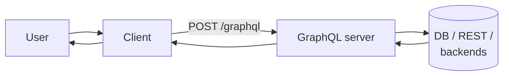
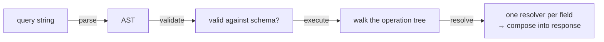
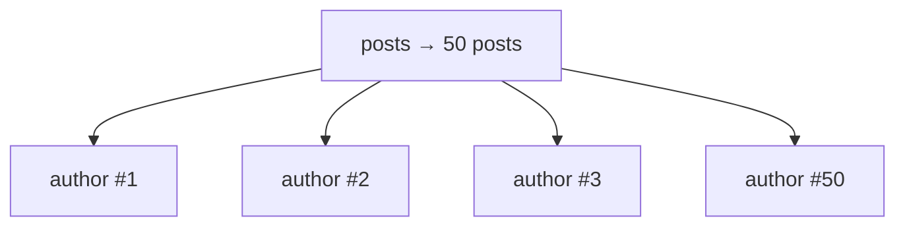
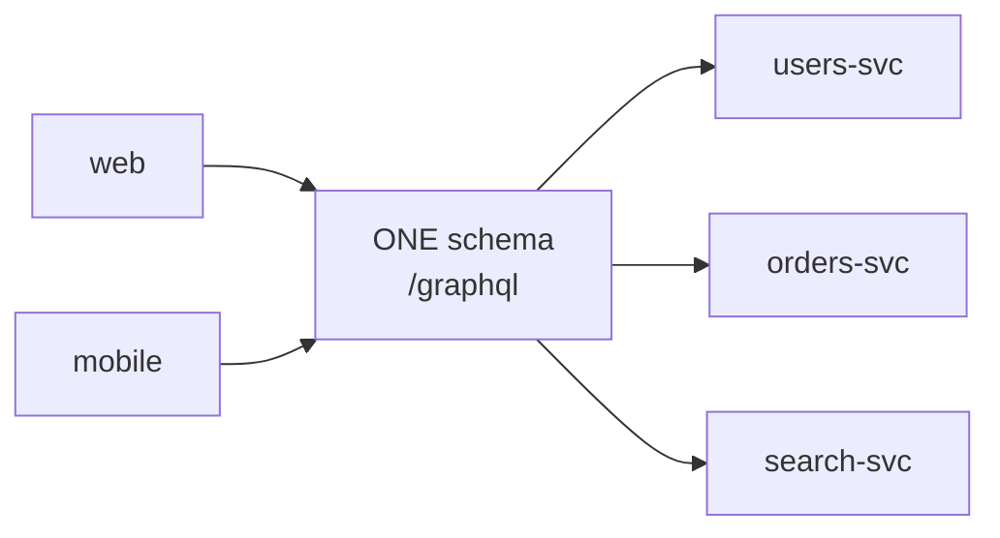
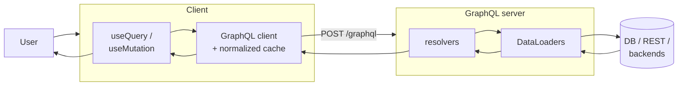

# GraphQL
## Practical Workshop

<div class="muted" style="margin-top:1.2rem">
query shape &nbsp;•&nbsp; resolvers &amp; DataLoader &nbsp;•&nbsp; schema design &nbsp;•&nbsp; production guards &nbsp;•&nbsp; the client
</div>

<div style="margin-top:2.5rem" class="muted text-sm">
Each section <strong>teaches the concepts</strong>, runs a <span class="tag">TERMINAL DEMO</span>, then ends with a few <strong>live questions</strong> to test understanding.
</div>

<!--
Pattern, every section: explain the concepts, run a broken/fixed demo, then 2-3 live questions
at the end of the section. Vendor-neutral; examples are realistic but generic.
-->

---
layout: center
---

# What you'll build intuition for

<div class="col-2" style="margin-top:1.5rem; text-align:left">
<div class="card">

### Read &amp; write
Read SDL, write operations and fragments, and predict the exact response shape.

</div>
<div class="card">

### Build &amp; ship
Recognize N+1, choose sane schema shapes, handle errors, protect production, and reason about the client cache.

</div>
</div>

<div class="muted text-sm" style="margin-top:1.5rem">
By the end you can confidently start reading and contributing to a GraphQL codebase — server or client.
</div>

---
layout: center
---

# Workshop setup

<div style="max-width:52rem; margin:1rem auto; text-align:left">

<CopyCommand demo="list" setup label="Setup: clone, install, list examples" />

<div class="lab-steps">

1. Copy and run the setup command.
2. Keep a terminal open beside the slides.
3. When a demo slide appears, run the one-line example command.
4. If setup is slow, follow the presenter output and keep going.

</div>
</div>

---
layout: center
---

# The shape of a GraphQL system


```mermaid {theme:'dark', scale:0.85}
flowchart LR
  U[User] --> C[Client]
  C -->|"POST /graphql"| S[GraphQL server]
  S --> B[("DB / REST /<br/>backends")]
  B --> S --> C --> U
```

<div class="muted text-sm" style="margin-top:0.6rem">
One typed endpoint in. The server resolves exactly the fields requested from whatever backends it has, and returns that precise shape. We'll name what lives inside the client and the server as we go — and return to this picture, fully labeled, at the end.
</div>

---
layout: center
---

# Flow

<div class="agenda-flow">
<div class="agenda-item">
  <span class="agenda-time">08-25</span>
  <div>
    <h3>Fundamentals</h3>
    <p>type system, single endpoint, query == response, operations, directives, polymorphism — then 2 questions</p>
    <code>npm run examples -- shape</code>
  </div>
</div>
<div class="agenda-item">
  <span class="agenda-time">25-40</span>
  <div>
    <h3>Resolvers &amp; DataLoader</h3>
    <p>resolver tree, context, the N+1 trap, the DataLoader fix — then 2 questions</p>
    <code>npm run examples -- dataloader</code>
  </div>
</div>
<div class="agenda-item">
  <span class="agenda-time">40-55</span>
  <div>
    <h3>Schema design</h3>
    <p>nullability, scalars, naming, cursor pagination, errors-as-data, deprecation — then 3 questions</p>
    <code>npm run examples -- schema</code>
  </div>
</div>
<div class="agenda-item">
  <span class="agenda-time">55-66</span>
  <div>
    <h3>Production concerns</h3>
    <p>gateway/BFF, cost guards, error hygiene, subscriptions — then 2 questions</p>
    <code>npm run examples -- production</code>
  </div>
</div>
<div class="agenda-item">
  <span class="agenda-time">66-85</span>
  <div>
    <h3>The client</h3>
    <p>codegen, normalized cache, fetch policy, fragments, optimistic UI — then 3 questions</p>
    <code>npm run examples -- client</code>
  </div>
</div>
</div>

<div class="muted text-sm" style="margin-top:0.7rem">
85-90 · recap, bonus round, and the leaderboard.
</div>

---
layout: center
class: text-center
---

# Join the quiz <span style="font-size:0.8em">🏆</span>

<div class="muted" style="margin-bottom:1.6rem">each section ends with live questions — first answer counts, top 3 win a prize at the end</div>

<JoinGate />

---
layout: section
---

# Fundamentals
<div class="muted">the type system, the single endpoint, why it beats N REST calls</div>

---

# The 60-second mental model

<div class="col-2">
<div>

GraphQL is a **query language + a server runtime** for APIs.

- The **schema is the contract** — written in SDL, strongly typed. Validation and tooling come for free.
- The client **declares the shape** it wants; the server returns **precisely that**.
- **Transport- and database-agnostic.** It sits on top of any backend (REST, DB, microservices).

</div>
<div>

<div class="card">

<div class="mm-head">It is <strong>NOT</strong></div>
<div class="mm-row"><span class="mm-ic bad">✕</span> a database</div>
<div class="mm-row"><span class="mm-ic bad">✕</span> a graph database <span class="muted">(no relation to Neo4j)</span></div>
<div class="mm-row"><span class="mm-ic bad">✕</span> tied to any language or storage</div>

<div class="mm-head" style="margin-top:0.9rem">It <strong>IS</strong></div>
<div class="mm-row"><span class="mm-ic good">✓</span> a spec + a runtime</div>
<div class="mm-row"><span class="mm-ic good">✓</span> one typed schema, one endpoint</div>
<div class="mm-row"><span class="mm-ic good">✓</span> an API layer over what you already have</div>

</div>
</div>
</div>

<!--
The most common misconception: "graph" makes people think graph DB. Kill it early.
It is an API layer in front of whatever backends you already have.
-->

---

# The REST pains it solves

<div class="col-2">
<div>

**Over-fetching** — the endpoint returns far more than the screen needs.

**Under-fetching** — you need N calls to assemble one screen (the request *waterfall*).

</div>
<div>

```bash
# REST: a waterfall of round trips
GET /users/1            # over-fetch: tons of unused fields
GET /users/1/posts      # [{id,title}, ...]
GET /posts/101/comments # ...
GET /posts/102/comments # ...
```

</div>
</div>

```graphql
# GraphQL: ONE request, exactly the fields needed, fully nested
query {
  user(id: "1") {
    name
    posts { title comments { text } }
  }
}
```

<div class="muted text-sm">Four dependent REST calls collapse into a single tailored query. This is the core win.</div>

---

# The schema: your first type

<div class="muted text-sm" style="margin-bottom:0.4rem">SDL = <strong>Schema Definition Language</strong> — the one typed contract the client and server both agree on.</div>

<div class="col-2">
<div>

An **object type** groups named **fields**. Each field has a type of its own.

The leaves are **scalars** — the built-in primitives:

`ID` · `String` · `Int` · `Float` · `Boolean`

</div>
<div>

```graphql
type User {
  id: ID!         # unique identifier
  name: String!
  email: String
}
```

</div>
</div>

<div class="muted text-sm">Object types nest into each other; scalars are where the tree bottoms out. (Custom scalars like <code>DateTime</code> come in Schema design.)</div>

---

# Non-null and lists: the two modifiers

<div class="col-2">
<div>

Two symbols modify any field type:

- `!` = **non-null** — the value is guaranteed present
- `[ ]` = **list** — zero or more of that type

They **compose** — read them inside-out.

</div>
<div>

```graphql
type User {
  email: String        # may be null
  name:  String!       # never null
  tags:  [String!]!    # non-null list of
                       #   non-null strings
}
```

</div>
</div>

<div class="col-2" style="margin-top:0.4rem">
<div class="card">

`[String]` — list may be null, items may be null <br/>
`[String!]` — list may be null, items never null

</div>
<div class="card">

`[String]!` — list never null, items may be null <br/>
`[String!]!` — neither ever null

</div>
</div>

---

# Arguments and enums

<div class="col-2">
<div>

**Fields take arguments** — like function parameters, optionally with a **default**.

**Enums** lock a field to a fixed set of named values.

</div>
<div>

```graphql
enum Role { ADMIN EDITOR VIEWER }

type User {
  role: Role!
  # argument with a default:
  posts(limit: Int = 10): [Post!]!
}
```

</div>
</div>

<div class="muted text-sm">So far: <strong>object types</strong>, <strong>scalars</strong>, <strong>fields</strong>, <strong>non-null &amp; lists</strong>, <strong>arguments</strong>, <strong>enums</strong>. Still ahead: <strong>interfaces</strong> &amp; <strong>unions</strong> (next), and <strong>input types</strong> (with mutations).</div>

---

# Query == response shape

<div class="col-2">
<div>
<div class="src">// what the client sends</div>

```graphql {all|3-8}
query GetUser {
  user(id: "1") {
    name
    role
    posts(limit: 1) {
      title
    }
  }
}
```
</div>
<div>
<div class="src">// what comes back — identical tree</div>

```json {all|3-9}
{
  "data": {
    "user": {
      "name": "Ada Lovelace",
      "role": "EDITOR",
      "posts": [
        { "title": "On the Analytical Engine" }
      ]
    }
  }
}
```
</div>
</div>

<div class="muted text-sm">No <code>email</code>, no <code>id</code>, no <code>body</code> — they were never requested, so they are absent. <strong>No over-fetch, by construction.</strong></div>

---

# Relating types: interfaces &amp; unions

<div class="muted text-sm" style="margin-bottom:0.4rem">What if one field can return <em>more than one</em> type — say a search that yields users <em>or</em> posts? Two tools for that:</div>

```graphql {all|1-5|7|9-15}
interface Node {       # interface = SHARED fields across types
  id: ID!
}
type User implements Node { id: ID!  name: String! }
type Post implements Node { id: ID!  title: String! }

union SearchResult = User | Post   # union = one-of, NO shared fields required

query {
  search(term: "ada") {
    ... on User { name }    # pick fields only when the value is a User
    ... on Post { title }
    __typename              # built-in meta-field: the concrete type name at runtime
  }
}
```

<div class="muted text-sm"><strong>Interface</strong> = types that share queryable fields. <strong>Union</strong> = a one-of with nothing in common. The server decides which concrete type a value is via <code>__resolveType</code> (a resolver — next chapter).</div>

<div class="muted text-sm" style="margin-top:0.4rem">The <code>... on User</code> form is an <strong>inline fragment</strong> — it selects fields only when the value is that concrete type. <code>__typename</code> returns the runtime type name (so the client knows which it got), and later doubles as the client cache's identity key.</div>

---

# Three root operation types

```graphql {all|1-4|6-12|14-16}
type Query {            # READ — fields run in PARALLEL
  user(id: ID!): User
  posts: [Post!]!
}

input CreatePostInput {        # input types: arguments only, never output types
  title: String!
  body: String!
  authorId: ID!
}
type Mutation {                # WRITE — top-level fields run SERIALLY, in order
  createPost(input: CreatePostInput!): Post!
}

type Subscription {            # STREAM — a long-lived result the server
  postAdded: Post!             # pushes new values over time (details in Production)
}
```

<div class="muted text-sm"><strong>Query</strong> fields resolve in parallel; top-level <strong>mutation</strong> fields resolve one-by-one, top to bottom. Don't rely on ordering between query fields.</div>

<!--
Subscription is concept-only in this workshop — no terminal demo backs it. The SDL here is illustrative;
the workshop schema has no postAdded field. We define what a subscription IS in Production.
-->

---

# One endpoint. Data can be partial.

```bash {all|1-7|8}
curl -X POST https://api.example.com/graphql \
  -H 'Content-Type: application/json' \
  -d '{
    "query": "query($id: ID!) { user(id: $id) { name role } }",
    "variables": { "id": "1" }
  }'
# -> often HTTP 200, body: { "data": {...}, "errors": [...] }
```

<div class="col-2" style="margin-top:1rem">
<div class="card">

🔑 The whole API is **one POST URL**. Variables travel **separately** from the query string.

</div>
<div class="card">

⚠️ Field execution errors often return **200 with partial data**. Validation, auth, and rate-limit failures may be **4xx**. Always check **`errors[]`**.

</div>
</div>

<div class="muted text-sm" style="margin-top:0.6rem">Why a 200 can still carry errors — and how partial data arises (non-null error propagation) — comes in <strong>Resolvers</strong> and <strong>Schema design</strong>.</div>

---

# Directives: annotations on the schema and queries

<div class="col-2">
<div>

A **directive** is an annotation, written `@name(args)`, attached to a schema element or a query element. They change how that element is treated — without changing its type.

- **Built-in:** `@deprecated`, `@include(if:)`, `@skip(if:)`, `@specifiedBy(url:)`
- **Custom:** you can define your own, e.g. `@cost(weight:)`

</div>
<div>

```graphql
# on the schema
type Post {
  modifiedAt: DateTime!
    @deprecated(reason: "use updatedAt instead [2026-09-01]")
}

# on a query
query {
  user(id: "1") {
    name
    riskScore @include(if: $withRisk)
  }
}
```

</div>
</div>

<div class="muted text-sm">Every later <code>@x</code> in this talk — deprecation, cost limiting, the unreleased-field trap — is an instance of this one feature.</div>
---

# Introspection powers the tooling

<div class="col-2">
<div>

The schema can describe **itself** at runtime via `__schema` / `__type`.

This is what powers:
- autocomplete in **GraphiQL / Apollo Sandbox**
- the live **docs panel**
- client **codegen** (typed operations — client section)

</div>
<div>

```graphql
query IntrospectTheSchema {
  __schema {
    queryType { name }
    types {
      name
      kind   # OBJECT | SCALAR | ENUM
             # INTERFACE | UNION | INPUT_OBJECT
      fields { name }
    }
  }
}
```

</div>
</div>

<div class="muted text-sm">Common production hardening: gate or disable introspection so the full schema / attack surface isn't exposed publicly.</div>

---
layout: center
---

# Demo: query shape

<div style="max-width:50rem; margin:1rem auto; text-align:left">

<CopyCommand demo="shape" label="Demo: REST waterfall -> GraphQL shape" />

<div class="lab-steps compact">

1. Run the command.
2. Compare the REST over-fetch/waterfall output with the GraphQL output.
3. Add <code>email</code> to the query in <code>examples/01-query-shape.js</code>.
4. Rerun and confirm the response changes only where the selection set changed.

</div>
</div>

<div class="muted text-sm" style="margin-top:0.8rem">
Watch three basics: selected fields define <code>data</code>, invalid fields fail validation, variables stay separate from the query.
</div>

---
layout: center
class: text-center
---

# Check your understanding <span style="font-size:0.7em">— Fundamentals</span>

<div class="muted" style="margin-top:1rem">two live questions on the type system and operations</div>

---
layout: center
class: text-center
---

<div class="q-title"><span class="tag tag-live">LIVE&nbsp;QUESTION</span><span class="q-title-text">Response shape</span></div>

<div style="max-width:48rem; margin:1rem auto; text-align:left">

<Quiz
  qid="q1-fundamentals-shape"
  :multiline="true"
  question="The User type has a non-null field id: ID!. Your query selects only name. What comes back — and is omitting a non-null field even allowed?"
  :options="[
    'An error — non-null fields must always be selected',
    'Just name; you may omit any field, even a non-null one — ! constrains the value when selected, not whether you select it',
    'name and id, because a non-null id is added automatically',
    'name plus every non-null field of User',
  ]"
  :answer="1"
  explanation="You request the shape you want and get exactly that. <code>!</code> (non-null) constrains a field <em>value</em> when you select it — it never forces selection, and <code>id</code> is never auto-added."
/>

</div>

---
layout: center
class: text-center
---

<div class="q-title"><span class="tag tag-live">LIVE&nbsp;QUESTION</span><span class="q-title-text">Root operations</span></div>

<div style="max-width:48rem; margin:1rem auto; text-align:left">

<Quiz
  qid="q15-root-ops"
  :multiline="true"
  question="A mutation runs three top-level fields in order: createAccount, then chargeCard(accountId), then sendReceipt(accountId). Can chargeCard rely on createAccount having already finished?"
  :options="[
    'No — top-level fields may run in any order, so chargeCard could run before the account exists',
    'Yes — top-level mutation fields run serially in document order, so createAccount finishes before chargeCard starts',
    'Only if all three are wrapped in a transaction directive',
    'Yes, but only because all three share the same accountId argument',
  ]"
  :answer="1"
  explanation="Top-level <strong>mutation</strong> fields execute <strong>serially</strong>, top to bottom — each finishes before the next begins, so later writes can depend on earlier ones. Top-level <strong>query</strong> fields run in parallel, so never rely on their order."
/>

</div>

---
layout: section
---

# Resolvers &amp; DataLoader
<div class="muted">how fields get their values — and the N+1 trap every team hits</div>

---

# Server-side request lifecycle


```mermaid {theme:'dark', scale:0.95}
flowchart LR
  S["query string"] -->|parse| A["AST"]
  A -->|validate| V["valid against schema?"]
  V -->|execute| E["walk the operation tree"]
  E -->|resolve| R["one resolver per field<br/>→ compose into response"]
```

<div class="card" style="margin-top:1.2rem; max-width:30rem">

A **resolver** is a function returning one field's value:

```ts
(parent, args, context, info) => value
```

</div>

<div class="muted text-sm" style="margin-top:0.6rem">Parse the text into an <strong>AST</strong> (abstract syntax tree), validate it against the schema, then execute — calling one resolver per selected field. <strong>Validation runs before execution</strong> (remember this for the unreleased-field trap).</div>

---

# The four resolver arguments

```ts {all|2|3|4|5}
function resolver(parent, args, context, info) {
  // parent  = the resolved value one level up (your input)
  // args    = the GraphQL field arguments
  // context = per-request shared state (auth user, loaders, db handles, logger)
  // info    = resolution AST / metadata (rarely needed)
  return value
}
```

<div class="col-2" style="margin-top:0.8rem">
<div class="card">

If you **don't** write a field resolver, the default one just returns `parent[fieldName]`.

</div>
<div class="card">

A useful pattern: **return `parent.field` if already present**, otherwise fetch it. Cheap when the parent already hydrated it.

</div>
</div>

<div class="bad text-sm">⚠️ A non-null field that resolves to <code>null</code> makes the server throw — and the error <em>propagates up</em>, nulling the parent. Nullability is a real design decision — full treatment in Schema design.</div>

---

# Resolvers compose into a tree

<div class="col-2">
<div>

```graphql
query {
  post(id: "101") {   # Query.post
    title             #   Post.title
    author {          #   Post.author
      name            #     User.name
    }
  }
}
```

</div>
<div>

```ts
const resolvers = {
  Query: {
    post: (_p, args, ctx) => ctx.db.post(args.id),
  },
  Post: {
    // parent = the post returned above
    author: (post, _a, ctx) => ctx.db.user(post.authorId),
  },
}
```

</div>
</div>

<div class="muted text-sm">Each field's return value becomes the <code>parent</code> of its children. Resolution walks <strong>down</strong> the tree, one resolver per field. <span class="muted">(The demo wires the same logic via a <code>rootValue</code> + per-field closures — same shape, see the comments in <code>examples/lib/workshop-schema.js</code>.)</span></div>

---

# Resolution runs one resolver per field

<div class="col-2">
<div>

Walk the query top-down. Each field calls its **own** resolver, and that result becomes the **parent** of the fields nested beneath it.

```graphql
query {
  posts {            # 1 call → 50 posts
    title            #   read off the parent
    author {         #   resolver runs
      name           #   once PER post
    }
  }
}
```

</div>
<div>

<div class="card">

**Calls, for 50 posts**

`Query.posts` → **1** <br/>
`Post.title` ×50 → from parent, no fetch <br/>
`Post.author` ×50 → **50 fetches**

<div class="muted text-sm" style="margin-top:0.8rem">A field nested under a <strong>list</strong> resolves <strong>once per item</strong> — cheap when it reads off the parent, costly when the resolver actually fetches.</div>

</div>

</div>
</div>

<div class="muted text-sm" style="margin-top:1rem; text-align:center">Hold that thought — <code>Post.author</code> firing once per post is exactly the trap on the next slide.</div>

---

# The N+1 problem

<div class="col-2">
<div>

A list of **N** posts; each `Post.author` resolver fetches its user.

**Naive:** 1 query for the list **+ N** queries for the authors → **N+1** round trips.

</div>
<div>


```mermaid {theme:'dark', scale:0.62}
flowchart TB
  Q["posts → 50 posts"] --> A1["author #1"]
  Q --> A2["author #2"]
  Q --> A3["author #3"]
  Q --> AN["author #50"]
```

</div>
</div>

```ts
// ❌ N+1: one DB/REST call PER post
Post: { author: (post, _a, ctx) => ctx.db.user(post.authorId) }
```

<div class="bad text-sm">50 posts on a screen → 51 backend calls. This is the single most common GraphQL performance bug.</div>

---

# DataLoader: batch + cache per request

<div class="col-2">
<div>

A **DataLoader** collects every `.load(key)` call in a tick, hands them to **one** batch function, and caches by key **within the request**.

```ts
const userLoader = new DataLoader(
  async (ids) => {
    const users = await db.usersByIds(ids) // ONE call
    return ids.map(id => users[id])
  }
)
```

</div>
<div>

```ts {all|3}
// ✅ N+1 gone: 50 .load() calls -> 1 batched fetch
Post: {
  author: (post, _a, ctx) =>
    ctx.loaders.user.load(post.authorId),
}
```

<div class="card" style="margin-top:0.6rem">

**Batch** — coalesce a tick's loads into one call. <br/>
**Cache** — dedupe identical keys in the request.

</div>
</div>
</div>

<div class="bad text-sm">⚠️ Build loaders <strong>per request</strong> (never module-global) — a shared cache would leak one user's data into another's. And <code>await</code>-in-a-loop defeats batching.</div>

<CopyCommand demo="dataloader" label="Demo: broken N+1 -> DataLoader batching" />

<div class="lab-steps compact">
Compare <code>backendCalls</code> in mode <code>naive</code> vs mode <code>loader</code>. Then trace <code>post.authorId</code> into the <code>Post.author</code> resolver.
</div>

---
layout: center
class: text-center
---

# Check your understanding <span style="font-size:0.7em">— Resolvers &amp; DataLoader</span>

<div class="muted" style="margin-top:1rem">two live questions on resolution and the N+1 fix</div>

---
layout: center
class: text-center
---

<div class="q-title"><span class="tag tag-live">LIVE&nbsp;QUESTION</span><span class="q-title-text">The lifecycle</span></div>

<div style="max-width:48rem; margin:1rem auto; text-align:left">

<Quiz
  qid="q2-lifecycle-order"
  :multiline="true"
  question="A query asks user(id: 1) { name nickname } but nickname is not in the schema. Where does it fail, and do any resolvers run?"
  :options="[
    'At execution — the name resolver runs first, then it fails on nickname',
    'At validation, before execution — the whole document is checked against the schema, so no resolver runs',
    'At parsing — the query string is syntactically invalid',
    'It does not fail; nickname just comes back as null',
  ]"
  :answer="1"
  explanation="Order is parse → <strong>validate</strong> → execute. An unknown field is a <strong>validation</strong> error caught against the schema before any resolver runs — which is also why <code>@include</code> tricks cannot smuggle in unreleased fields."
/>

</div>

---
layout: center
class: text-center
---

<div class="q-title"><span class="tag tag-live">LIVE&nbsp;QUESTION</span><span class="q-title-text">Debug the N+1</span></div>

<div style="max-width:48rem; margin:1rem auto; text-align:left">

<Quiz
  qid="q3-n-plus-1"
  :multiline="true"
  question="You added a DataLoader for Post.author, but the logs STILL show one user query per post. What is the most likely cause?"
  :options="[
    'The author field is marked non-null, which disables batching',
    'You await each load() inside a loop, so each runs in its own tick and nothing batches',
    'DataLoader only batches mutations, not queries',
    'The users table is missing an index on id',
  ]"
  :answer="1"
  explanation="DataLoader batches the <code>.load()</code> calls made within one tick. <code>await</code>-ing each load inside a loop pushes each into its own tick, so the batch only ever holds one key. Fire all the <code>.load()</code> calls first, then await."
/>

</div>

---
layout: section
---

# Schema design
<div class="muted">the conventions that keep a large schema healthy</div>

---

# Nullability is a contract + precise scalars

<div class="col-2">
<div>

- Mark `!` **only** when the data **truly cannot** be null.
- If a backend *might* return null → keep it **nullable**, so clients never crash on "guaranteed" data.
- Use **precise custom scalars** over `String`/`Int`.

</div>
<div>

```graphql
scalar DateTime        # RFC 3339 UTC
scalar EmailAddress
  @specifiedBy(url: "https://html.spec…")
scalar URL
scalar NonEmptyString
scalar NonNegativeInt  # for pagination `first`
scalar SafeInt         # numbers > Int32
```

<div class="muted text-sm" style="margin-top:0.3rem">Mostly common community scalars (e.g. graphql-scalars) — pick the precise one per field.</div>

</div>
</div>

<div class="bad text-sm" style="margin-top:0.5rem">⚠️ Over-non-nulling is dangerous: a non-null field that resolves to <code>null</code> <strong>nulls out its entire parent object</strong> (error propagation).</div>

---

# Naming rules

<div class="col-2">
<div>

**Types** — UpperCamelCase, domain-specific.

```graphql
# ❌ collides in a large schema
type Session { ... }
# ✅ specific
type CheckoutSession { ... }
```

**Enums** — CAPITAL_CASE values, no `Enum` suffix.

```graphql
enum OrderStatus { ACTIVE SHIPPED }
```

</div>
<div>

**Fields** — no `get`/`list` prefixes; camelCase, no leaky snake_case.

```graphql
extend type Query {
  user(id: ID!): User    # not getUser
  users: [User!]!        # not listUsers
}
# modified_at -> updatedAt
```

<div class="muted text-sm">Field names are part of the public contract — make them describe the data, not the transport.</div>

</div>
</div>

---

# Paginate everything — use cursors

<div class="col-2">
<div>

Never return an **unbounded list** (`files: [File!]!`) — one client can pull the whole table.

**Offset/limit** breaks under concurrent writes (skips/duplicates rows) and is slow at depth.

**Cursor-based (Relay Connection)** is stable and the industry default.

</div>
<div>

```graphql
type FileEdge { cursor: String!  node: File! }

type FileConnection {
  edges: [FileEdge!]!
  pageInfo: PageInfo!
  totalCount: Int          # nullable: backend may not count
}

type PageInfo {
  endCursor: String
  hasNextPage: Boolean!
}

extend type Query {
  files(first: NonNegativeInt = 2, after: String): FileConnection!
}
```

</div>
</div>

<div class="bad text-sm">⚠️ <code>after</code>/<code>first</code> with a cursor is stable under concurrent inserts/deletes; <code>offset</code> is not.</div>

<CopyCommand demo="schema" label="Demo: broken offset pagination -> cursor pagination" />

<div class="lab-steps compact">
Change <code>files(first: 2)</code> to <code>files(first: 3)</code> in <code>examples/04-schema-design.js</code> and inspect <code>pageInfo</code>.
</div>

---

# Mutation responses + errors-as-data

<div class="col-2">
<div>

Return a **wrapper**, never the bare type — so you can add fields later without a breaking change.

```graphql
type CreateFolderResponse {
  value: File          # null on failure
  errors: [CreateFolderError!]!
}
```

</div>
<div>

**Expected** failures are modeled as **data** (a typed union), not thrown into `errors[]`.

```graphql
interface MutationError {
  code: String!
  message: String!
}

type NameInUse implements MutationError { ... }
type NameTooLong implements MutationError { ... }

union CreateFolderError = NameInUse | NameTooLong
```

</div>
</div>

<div class="muted text-sm">Client switches on <code>__typename</code> instead of string-matching messages. The transport <code>errors[]</code> stays for the <em>unexpected</em>.</div>

<CopyCommand demo="errors" label="Demo: null bubbling -> typed errors-as-data" />

<div class="lab-steps compact">
Compare the nullable <code>bio</code> failure with the non-null <code>reputation</code> failure. Then change <code>createFolder("inbox")</code> to a new name.
</div>

---

# Versioning by deprecation

<div class="col-2">
<div>

GraphQL usually evolves **additively**. Prefer one graph over a parallel `/v2`.

1. Add the new field.
2. Mark the old one `@deprecated` with a **dated** removal plan.
3. Watch usage telemetry, then remove.

</div>
<div>

```graphql
type Post {
  updatedAt: DateTime!
  modifiedAt: DateTime!
    @deprecated(reason:
      "use updatedAt instead [2026-09-01]")
}
```

</div>
</div>

<div class="muted text-sm">A parallel <code>/v2</code> schema fragments the graph and doubles maintenance. Deprecate in place unless a truly incompatible platform split forces otherwise. <code>@deprecated</code> is shown to clients through introspection — try the <code>schema</code> demo.</div>

---
layout: center
class: text-center
---

# Check your understanding <span style="font-size:0.7em">— Schema design</span>

<div class="muted" style="margin-top:1rem">three live questions on nullability, pagination, and errors</div>

---
layout: center
class: text-center
---

<div class="q-title"><span class="tag tag-live">LIVE&nbsp;QUESTION</span><span class="q-title-text">Nullability</span></div>

<div style="max-width:48rem; margin:1rem auto; text-align:left">

<Quiz
  qid="q4-nullability"
  :multiline="true"
  question="A field is typed reputation: Int! but the backend sometimes returns null for it. What happens when it does?"
  :options="[
    'The client receives reputation: null and renders fine',
    'The server throws; the null propagates up and nulls the whole parent object',
    'GraphQL coerces the null to 0 because Int has a default',
    'The request fails with HTTP 400 and returns no data',
  ]"
  :answer="1"
  explanation="A non-null field resolving to <code>null</code> is an execution error that <strong>propagates upward</strong>, nulling the nearest nullable parent — you lose the whole object, not just the field. Mark <code>!</code> only when the data truly cannot be null. (Status stays 200 — it is a field error.)"
/>

</div>

---
layout: center
class: text-center
---

<div class="q-title"><span class="tag tag-live">LIVE&nbsp;QUESTION</span><span class="q-title-text">Pagination</span></div>

<div style="max-width:48rem; margin:1rem auto; text-align:left">

<Quiz
  qid="q5-pagination"
  :multiline="true"
  question="A user reads page 1 of an offset-paginated feed (limit/offset). Meanwhile 3 new items are inserted at the top. What do they see on page 2?"
  :options="[
    'Nothing wrong — offset and cursor behave the same here',
    'Items from the end of page 1 repeat on page 2, because offset counts positions that shifted',
    'Page 2 fails to load with a cursor error',
    'The 3 new items appear at the top of page 2',
  ]"
  :answer="1"
  explanation="Offset addresses a <em>position</em> that moves when rows are inserted or deleted, so concurrent writes skip or duplicate rows. A <strong>cursor</strong> points at a stable item, so the next page is always after that item regardless of inserts — which is why cursor/Connection is the default."
/>

</div>

---
layout: center
class: text-center
---

<div class="q-title"><span class="tag tag-live">LIVE&nbsp;QUESTION</span><span class="q-title-text">Errors as data</span></div>

<div style="max-width:48rem; margin:1rem auto; text-align:left">

<Quiz
  qid="q6-errors-as-data"
  :multiline="true"
  question="createFolder can fail two ways: the name is already taken (the user can pick another), or the folder service is down. Where should each failure surface?"
  :options="[
    'Both in the top-level errors[] array',
    'Both as typed-union data on the response',
    'Name taken as typed-union data the UI handles; service down in the top-level errors[]',
    'Name taken as HTTP 409; service down as HTTP 503',
  ]"
  :answer="2"
  explanation="<strong>Expected, recoverable</strong> failures (name taken) become <strong>data</strong> via a typed union so the UI handles them with the type system. <strong>Unexpected</strong> failures (service down) belong in the top-level <code>errors[]</code>. Mixing them forces clients to string-match messages."
/>

</div>

---
layout: section
---

# Production concerns
<div class="muted">the gateway pattern, security, cost limiting, errors, subscriptions</div>

---

# GraphQL as a Backend-for-Frontend

<div class="col-2">
<div>

A common production shape: GraphQL is a **gateway / BFF** in front of existing REST microservices.

The gateway is the right place to centralize:
- **batching** (DataLoader)
- **auth** normalization
- **error** normalization
- **query-cost** limiting
- access control

</div>
<div>


```mermaid {theme:'dark', scale:0.72}
flowchart LR
  C1[web] --> G
  C2[mobile] --> G
  G["ONE schema<br/>/graphql"]
  G --> S1[users-svc]
  G --> S2[orders-svc]
  G --> S3[search-svc]
```

</div>
</div>

<div class="muted text-sm" style="margin-top:0.5rem">
Many clients converge on <strong>one</strong> typed endpoint; the gateway fans out to many backends so each client team doesn't reinvent batching, auth, and error handling. The schema is machine-readable, so you can also <strong>generate</strong> resolver types server-side and operation types client-side (client section). Often assembled from per-domain modules (<strong>schema stitching</strong>) or independently-deployed subgraphs (<strong>federation</strong>).
</div>

---

# Security: depth alone is not enough

<div class="col-2">
<div>

A single malicious nested query can DoS a server. Layers of defense:

- **max depth** — caps nesting
- **max aliases / directives** — caps fan-out
- **complexity / cost analysis** — caps total work
- **persisted queries / allowlists** — only registered operations run

</div>
<div>

```graphql
# a directive-driven cost model
directive @cost(weight: Int!) on FIELD_DEFINITION

type Query {
  search(term: String!): [Result!]!
    @cost(weight: 10)
}
```

<div class="card" style="margin-top:0.6rem">

Assign each field a cost, sum per operation, **reject** before execution if it exceeds the budget.

</div>
</div>
</div>

<div class="bad text-sm">⚠️ A shallow-but-wide query (huge alias fan-out, one expensive field) stays under a depth cap yet costs a fortune. You need cost analysis.</div>

---

# Cost-based rate limiting

<div class="col-2">
<div>

Don't count **requests** — charge each operation its **computed cost** against a per-user token bucket.

In the demo, the **Normal** query costs **8** and passes; the **Wide** query (`4× expensiveReport` = cost **400**, 4 aliases) trips the `>30` cost / `>3` alias guard and is denied with **HTTP 429** + `retryAfter`.

</div>
<div>

```ts {all|1-3|5-6}
const cost = computeComplexity(document, schema)
if (cost >= MAX) throw new Error('too complex')

const ok = await rateLimiter.charge(userId, cost)
if (!ok) throw new TooManyRequests({ retryAfter })
```

</div>
</div>

<div class="muted text-sm">Apply the same cost checks to <strong>subscriptions</strong>, not just queries — a long-lived stream is expensive too.</div>

<CopyCommand demo="production" label="Demo: broken request counting -> cost guards" />

<div class="lab-steps compact">
Lower the demo cost budget from <code>30</code> to <code>5</code>, rerun, and decide whether the normal query should still pass.
</div>

---

# Error hygiene &amp; subscriptions

<div class="col-2">
<div>

### Error hygiene
- **Mask** internal messages / stack traces in prod — don't leak topology.
- Map backend status → a stable GraphQL **error code**.
- Keep the split from Schema design: **expected** failures are data; **unexpected** ones go in `errors[]`.

</div>
<div>

### Subscriptions
A **subscription** is a long-lived **server→client** stream for events (e.g. `postAdded`); the client subscribes once and handles each pushed value (an operation, like a query or mutation). Transport:

- **SSE** — one-way, rides plain HTTP, simple to scale. Default for push.
- **WebSocket** — bidirectional but stateful, awkward behind HTTP load balancers.

</div>
</div>

<div class="muted text-sm">Pick SSE when you only need server→client push (most cases). Either way, apply auth + cost limits to subscriptions.</div>

---
layout: center
class: text-center
---

# Check your understanding <span style="font-size:0.7em">— Production concerns</span>

<div class="muted" style="margin-top:1rem">two live questions on the gateway and DoS defense</div>

---
layout: center
class: text-center
---

<div class="q-title"><span class="tag tag-live">LIVE&nbsp;QUESTION</span><span class="q-title-text">Where to fix it</span></div>

<div style="max-width:48rem; margin:1rem auto; text-align:left">

<Quiz
  qid="q16-bff-gateway"
  :multiline="true"
  question="Web and mobile both reach users-svc and orders-svc through your GraphQL gateway. A new screen triggers an N+1 across orders. Where do you fix it so every client benefits at once?"
  :options="[
    'Separately in each client, query by query',
    'In the gateway — add a DataLoader at the resolver layer, so all clients get the batched fetch',
    'In orders-svc, by adding a caching column',
    'Nowhere — N+1 is a client-side concern',
  ]"
  :answer="1"
  explanation="The gateway / <strong>BFF</strong> is the shared layer where batching (DataLoader), auth, error normalization, and cost limiting live once — every client inherits the fix. Patching per-client duplicates work and drifts."
/>

</div>

---
layout: center
class: text-center
---

<div class="q-title"><span class="tag tag-live">LIVE&nbsp;QUESTION</span><span class="q-title-text">DoS defense</span></div>

<div style="max-width:48rem; margin:1rem auto; text-align:left">

<Quiz
  qid="q7-dos-depth"
  :multiline="true"
  question="Your API rejects any query deeper than 5 levels. An attacker sends a depth-2 query that aliases one expensive search field 400 times, and the server falls over. What guard was missing?"
  :options="[
    'A lower max-depth limit than 5',
    'Cost/complexity analysis that prices the whole operation and rejects it before execution',
    'Disabling introspection in production',
    'A database index on the search table',
  ]"
  :answer="1"
  explanation="A wide-but-shallow query stays under any depth cap yet does enormous work. You need <strong>cost analysis</strong> — sum per-field weights and reject over budget — plus cost-based rate limiting. Depth alone cannot see fan-out."
/>

</div>

---
layout: section
---

# The client
<div class="muted">setup · codegen · the normalized cache · fetch policies · fragments · optimistic UI</div>

---

# Setting up a client

<div class="col-2">
<div>

A GraphQL client is just **a transport link + a cache**, wrapped in a provider. The big three:

- **Apollo Client** — batteries-included, the default
- **urql** — lighter, modular
- **Relay** — strict, compiler-driven, Facebook-scale

</div>
<div>

```ts {all|2|3|6}
const client = new ApolloClient({
  link: new HttpLink({ uri: '/graphql' }),  // transport
  cache: new InMemoryCache(),               // normalized store
})

// one provider, then useQuery/useMutation anywhere
<ApolloProvider client={client}>
  <App />
</ApolloProvider>
```

</div>
</div>

<div class="muted text-sm">The <strong>link</strong> is composable middleware — chain auth headers, retries, and error logging <em>before</em> the terminating HTTP link.</div>

---

# Codegen: typed operations

<div class="col-2">
<div>

Hand-written `Data`/`Variables` types **drift** from the schema. Codegen reads the schema and types every operation **end to end** — `useQuery(GET_USER)` is fully typed, no casts.

```ts {all|1-5|6-7}
const GET_USER = graphql(`
  query GetUser($id: ID!) {
    user(id: $id) { id name email }
  }
`)
type Data = ResultOf<typeof GET_USER>      // { user: { id; name; email } | null }
type Vars = VariablesOf<typeof GET_USER>   // { id: string }
```

</div>
<div>

<div class="card">

**The pipeline**

`schema` + your `graphql()` operations <br/>
&nbsp;&nbsp;→ **codegen** <br/>
&nbsp;&nbsp;→ generated types <br/>
&nbsp;&nbsp;→ typed `useQuery` / `useMutation`

<div class="muted text-sm" style="margin-top:0.5rem">Tools: graphql-codegen · gql.tada · Relay · regenerate on every schema change</div>

</div>

</div>
</div>

<div class="bad text-sm">⚠️ Generated files are build output — never hand-edit them. Fix the schema and re-run codegen.</div>

<CopyCommand demo="client" label="Demo: type drift -> generated operation shape" />

<div class="lab-steps compact">
Find the hand-written <code>fullName</code> mismatch — then connect it to why generated types matter in review.
</div>

---

# Two caches, different jobs

<div class="col-2">
<div>

### Server: **DataLoader**

- batches + dedupes within **one request**
- built fresh per request, **thrown away** after
- solves the **N+1** problem

</div>
<div>

### Client: **normalized cache**

- normalizes entities by **`__typename` + `id`**
- **cross-component, cross-time** store
- a list and a detail panel share **one** cached entity

</div>
</div>

<div class="muted text-sm" style="margin-top:0.8rem">
A GraphQL client uses one POST endpoint, so browser/CDN URL caching is less useful than with REST. The client instead normalizes the response graph into a flat store. A mutation that returns the changed entity auto-updates every view of it.
</div>

<div class="card" style="margin-top:0.6rem">
Same word "cache", two completely different problems. Don't confuse them.
</div>

---

# Normalization + pagination, on the client

```ts {all|2|4|6-9}
new InMemoryCache({
  possibleTypes: { Node: ['User', 'Post'] },      // interface → implementing types
  typePolicies: {
    Cart: { keyFields: ['id', 'region'] },         // custom identity when id isn't unique alone
    Query: {
      fields: {
        posts: relayStylePagination(['orderBy']),  // merge fetched pages by filter args
        search: relayStylePagination(),
      },
    },
  },
})
```

<div class="muted text-sm">The cache needs to know how to <strong>identify</strong> each entity (<code>keyFields</code>), how interfaces map to concrete types (<code>possibleTypes</code>), and how to <strong>merge</strong> paginated results.</div>

<CopyCommand demo="client" label="Demo: duplicate copies -> normalized cache" />

<div class="lab-steps compact">
Remove <code>__typename</code> from the Feed query in <code>examples/06-client-cache.js</code> and rerun. Notice why identity is cache infrastructure.
</div>

---

# Fragments: colocate &amp; compose

<div class="col-2">
<div>

A **named fragment** is a reusable selection set. (You met the *inline* form `... on Type` back in interfaces — this is the named, reusable version.) Colocate it with the component that needs those fields.

```graphql
fragment PostCard on Post {
  id
  title
  author { name }
}
```

</div>
<div>

Compose fragments into queries by spreading them:

```graphql
query Feed {
  posts {
    edges { node { ...PostCard } }
  }
}
```

<div class="muted text-sm"><strong>Fragment masking</strong> (Relay / gql.tada) hides a fragment's fields from everyone except its owner — components only see what they declared. Great for encapsulation in large apps.</div>

</div>
</div>

---

# Writing operations + fetch policy

<div class="col-2">
<div>

```ts {all|1-5|7-8}
const { data, loading, error } = useQuery(GET_USER, {
  variables: { id: userId },
  skip: !userId,
  fetchPolicy: 'cache-first',  // be explicit!
})

// user-triggered fetch:
const [search] = useLazyQuery(SEARCH)
```

</div>
<div>

**Choose `fetchPolicy` deliberately** (the default is often `cache-first`):

| policy | when |
|---|---|
| `cache-first` | stable reference data |
| `cache-and-network` | instant + refresh |
| `network-only` | always fresh, still cache |
| `no-cache` | mutable / never store |

</div>
</div>

<div class="bad text-sm">⚠️ An omitted <code>fetchPolicy</code> silently means <code>cache-first</code> — so a query can serve stale cached data without ever hitting the network. Set it explicitly so behavior is visible in review.</div>

---

# Mutations + cache updates

<div class="col-2">
<div>

```ts {all|1-2|4-9}
const [createPost] =
  useMutation(CREATE_POST)

await createPost({
  variables: { input },
  // option A: refetch affected queries
  refetchQueries: [{ query: FEED }],
  // option B: surgically update the cache
  update: (cache, { data }) => { /* … */ },
})
```

</div>
<div>

After a delete, manually evict from list fields, then garbage-collect orphans:

```ts
cache.modify({
  id: cache.identify({ __typename: 'Query' }),
  fields: {
    posts: (existing, { readField }) =>
      filterOut(existing, deletedId, readField),
  },
})
cache.gc()
```

</div>
</div>

<div class="muted text-sm">A mutation that <strong>returns the changed entity</strong> auto-updates the cache for free. Only reach for <code>update</code>/<code>refetchQueries</code> for list add/remove.</div>

---

# Optimistic updates — instant UI

<div class="col-2">
<div>

Don't wait for the round trip. Render the **expected** result immediately, reconcile (or roll back) when the server responds.

```ts {all|3-6}
useMutation(LIKE_POST, {
  variables: { id },
  optimisticResponse: {
    likePost: {
      __typename: 'Post', id, likes: likes + 1,
    },
  },
})
```

</div>
<div>

<div class="card">

1. client writes the optimistic result to the cache → **UI updates instantly**
2. real response arrives → cache reconciles
3. server errors → optimistic write is **automatically reverted**

</div>

<div class="muted text-sm" style="margin-top:0.6rem">The <code>__typename</code> + <code>id</code> must match so the cache updates the <em>same</em> normalized entity every view shares.</div>

</div>
</div>

---

# Loading, error &amp; network states

<div class="col-2">
<div>

`useQuery` returns more than `data`:

```ts {all|1|3-4}
const { data, loading, error,
        networkStatus, refetch, fetchMore } = useQuery(FEED, {
  errorPolicy: 'all',   // partial data + error, not all-or-nothing
})

if (loading) return <Spinner />
if (error && !data) return <ErrorView e={error} />
```

</div>
<div>

- **`errorPolicy: 'all'`** — field errors don't blank the screen; you get partial `data` *and* `error`.
- **`fetchMore`** — drives cursor pagination; merged by the cache field policy.
- **Suspense** — `useSuspenseQuery` plugs into React `<Suspense>` for declarative loading.

<div class="muted text-sm" style="margin-top:0.5rem">Remember: a GraphQL response can carry <strong>both</strong> <code>data</code> and <code>errors</code> — design the UI for partial success.</div>

</div>
</div>

---

# The unreleased-field trap

<div class="col-2">
<div>

You need a field the backend **hasn't shipped yet**. Tempting: gate it with `@include(if: $flag)`.

```graphql
query {
  user(id: $id) {
    name
    riskScore @include(if: $withRisk)   # ❌
  }
}
```

</div>
<div>

**That doesn't work.** The server **validates the whole document** against its schema *before* execution — unknown fields are rejected with `GRAPHQL_VALIDATION_FAILED`, **regardless** of directives.

<div class="card" style="margin-top:0.6rem">

✅ Keep the sent document to **released fields only**. If you must type-ahead, widen the **TypeScript type** (e.g. a manually-typed document) without putting the field in the selection set. Add it for real once the schema ships.

</div>
</div>
</div>

<div class="muted text-sm">This is the validation-before-execution rule from the lifecycle slide, biting in practice. Run the <code>client</code> demo — the <code>@include(if: false)</code> query still fails validation.</div>

---
layout: center
class: text-center
---

# Check your understanding <span style="font-size:0.7em">— The client</span>

<div class="muted" style="margin-top:1rem">three live questions on caching, codegen, and the validation trap</div>

---
layout: center
class: text-center
---

<div class="q-title"><span class="tag tag-live">LIVE&nbsp;QUESTION</span><span class="q-title-text">The two caches</span></div>

<div style="max-width:50rem; margin:0.6rem auto; text-align:left">

<Quiz
  qid="q8-two-caches"
  :multiline="true"
  question="Two users hit your server at the same instant. Why is per-request DataLoader caching safe, but making that loader a module-level singleton shared across requests is not?"
  :options="[
    'Singletons are simply slower than per-request objects',
    'A per-request loader is discarded after the response; a shared singleton would serve cached data from one request into another',
    'DataLoader throws if it is reused on a second request',
    'The client cache already does this, so the server should not cache at all',
  ]"
  :answer="1"
  explanation="Server DataLoader caching is scoped to <strong>one request</strong> and thrown away after — that is what makes it safe. A module-global cache would leak one request's data into another's. (The <em>client</em> normalized cache is the opposite: a deliberately cross-time store keyed by <code>__typename+id</code>.)"
/>

</div>

---
layout: center
class: text-center
---

<div class="q-title"><span class="tag tag-live">LIVE&nbsp;QUESTION</span><span class="q-title-text">Codegen</span></div>

<div style="max-width:50rem; margin:0.6rem auto; text-align:left">

<Quiz
  qid="q11-codegen"
  :multiline="true"
  question="You add avatarUrl to the User type in the schema and select it in a component, but TypeScript says avatarUrl is not on the result type. What went wrong?"
  :options="[
    'You must hand-add avatarUrl to the generated types file',
    'You did not re-run codegen, so the generated types do not know the new field yet',
    'avatarUrl needs an @include directive before it can be typed',
    'Apollo only types fields after the first runtime response',
  ]"
  :answer="1"
  explanation="Generated types come from the schema + your operations at <strong>build time</strong>, so they are only as current as your last codegen run. Re-run codegen after a schema change, and never hand-edit the generated file — that drift is exactly what codegen prevents."
/>

</div>

---
layout: center
class: text-center
---

<div class="q-title"><span class="tag tag-live">LIVE&nbsp;QUESTION</span><span class="q-title-text">The unreleased field</span></div>

<div style="max-width:50rem; margin:0.6rem auto; text-align:left">

<Quiz
  qid="q9-unreleased-field"
  :multiline="true"
  question="You gate an unshipped field with riskScore @include(if: false), so it is never executed — yet the request still fails with GRAPHQL_VALIDATION_FAILED. Why?"
  :options="[
    'if: false produced an empty selection set, which is illegal',
    'The whole document is validated against the schema BEFORE execution; @include/@skip only affect execution, so an unknown field is rejected anyway',
    '@include works only on fragments, not on fields',
    'The client cache rejected the field for having no type policy',
  ]"
  :answer="1"
  explanation="Validation runs on the entire document up front and ignores directive values — <code>@include</code>/<code>@skip</code> apply later, during execution. So a field the schema lacks fails validation even when gated off. Fix: send only released fields, and widen the <strong>TypeScript type</strong> if you must type-ahead."
/>

</div>

---
layout: section
---

# Recap &amp; where to go next
<div class="muted">the whole picture, your next steps, and the final quiz sprint</div>

---
layout: center
---

# The shape of a GraphQL system — full picture


```mermaid {theme:'dark', scale:0.7}
flowchart LR
  U[User] --> C
  subgraph C[Client]
    H["useQuery /<br/>useMutation"] --> AC["GraphQL client<br/>+ normalized cache"]
  end
  AC -->|"POST /graphql"| S
  subgraph S[GraphQL server]
    R["resolvers"] --> L["DataLoaders"]
  end
  L --> DATA[("DB / REST /<br/>backends")]
  DATA --> L --> R --> AC --> H --> U
```

<div class="muted text-sm" style="margin-top:0.5rem">
The same picture from the start — now every label is yours. One typed endpoint in; the server resolves exactly the fields requested and returns that precise shape. It all connects.
</div>

---

# The whole picture, one slide

<div class="col-2">
<div>

### Server
- thin **resolvers** `(parent, args, context, info)`, composing into a tree
- **DataLoader** to kill N+1: batch + cache per request, partial responses
- schema design: nullability-as-contract, precise scalars, cursor pagination
- mutation wrappers + **errors-as-data** unions, deprecation versioning
- gateway/BFF: cost limiting → 429, masked errors, SSE subscriptions

</div>
<div>

### Client
- a client = **link + normalized cache** (keyed by `__typename + id`)
- **codegen** → typed operations (`ResultOf`/`VariablesOf`); regenerate on schema change
- explicit per-hook **`fetchPolicy`**; design for partial `data` + `errors`
- colocated **fragments** (+ masking); **optimistic** updates for instant UI
- **mutations** auto-update the cache; send only **released** fields

</div>
</div>

<div class="muted text-sm" style="margin-top:1rem; text-align:center">Two halves, one graph. <code>data</code> mirrors the query; the server does the hard parts so each client doesn't reinvent them.</div>

---
layout: center
---

# Where to go next

<div class="col-2" style="text-align:left; margin-top:1rem">
<div class="card">

### Read
- the official **GraphQL spec** & graphql.org learn
- **Apollo / Relay** client docs
- **DataLoader** README — the batching model
- your team's schema **style guide**

</div>
<div class="card">

### Do
- open a **GraphQL IDE**, run a query
- write a resolver + a **DataLoader**
- add a **cursor-paginated** field
- write an **integration test** for a resolver
- ship a one-field change end-to-end

</div>
</div>

<div style="margin-top:2rem; text-align:center" class="muted">
Questions? Let's open an IDE and break something.
</div>

---
layout: center
class: text-center
---

# Bonus round <span style="font-size:0.8em">🏆</span>

<div class="muted">cross-cutting questions that span the whole talk — first answer counts, rack up points</div>

<!-- q10 is the always-run tiebreaker; run the rest as time allows, else straight to the leaderboard. -->

---
layout: center
class: text-center
---

<div class="q-title"><span class="tag tag-bonus">BONUS</span><span class="q-title-text">429 vs partial response</span></div>

<div style="max-width:50rem; margin:0.6rem auto; text-align:left">

<Quiz
  qid="q10-429-vs-partial"
  :multiline="true"
  question="An over-budget query gets HTTP 429 + retryAfter. A separate 50-item list returns HTTP 200 with most data + one entry in errors[]. Which explanation is correct?"
  :options="[
    'Both should be 200; the 429 is a bug — GraphQL always returns 200',
    'The 429 is cost-based rate limiting (computed cost charged to a per-user token bucket; deny → 429 + retryAfter); the list is a normal 200 because one rejected loader key became a per-field error, leaving the rest of data intact',
    'The 429 is from depth limiting; the list error is because errorPolicy defaults to all',
    'Both are produced by the error formatter, which sets the HTTP status from the backend',
  ]"
  :answer="1"
  explanation="Cost-based rate limiting prices expensive operations and rejects <em>pre-execution</em> with a real 429. Partial responses are a separate mechanism: a single rejected batch entry becomes a per-field error so the rest survives, and the status stays 200."
/>

</div>

---
layout: center
class: text-center
---

<div class="q-title"><span class="tag tag-bonus">BONUS</span><span class="q-title-text">Trace one field end to end</span></div>

<div style="max-width:50rem; margin:0.6rem auto; text-align:left">

<Quiz
  qid="q18-trace-synthesis"
  :multiline="true"
  question="In one response, a non-null field resolves to null AND a sibling list has one failed entry. What HTTP status, and what does data look like?"
  :options="[
    'HTTP 400 — the whole query is rejected',
    'HTTP 500 — a resolver threw, so the request fails',
    'Still HTTP 200 — the non-null null propagates up nulling its parent branch, while the sibling list keeps its good entries with one entry in errors[]',
    'HTTP 200 with full data — errors[] never affects data',
  ]"
  :answer="2"
  explanation="Field execution stays <strong>HTTP 200</strong>. A non-null field resolving to null throws and <strong>propagates up</strong>, nulling its nearest nullable parent (that branch of <code>data</code>). The sibling list survives with its good entries plus one <code>errors[]</code> entry — a <strong>partial response</strong>."
/>

</div>

---
layout: center
class: text-center
---

<div class="q-title"><span class="tag tag-bonus">BONUS</span><span class="q-title-text">Optimistic UI</span></div>

<div style="max-width:50rem; margin:0.6rem auto; text-align:left">

<Quiz
  qid="q13-optimistic"
  :multiline="true"
  question="A like button writes an optimisticResponse, but the server rejects the mutation. What does the user see, and why must the optimistic object carry the same __typename + id?"
  :options="[
    'The like sticks and you must undo it by hand; the id is optional',
    'The like shows instantly then auto-reverts on error; __typename + id make it patch the SAME normalized entity every view shares',
    'Nothing changes until the server responds; __typename + id are only for logging',
    'The mutation retries automatically; __typename + id pick which retry wins',
  ]"
  :answer="1"
  explanation="The optimistic result is written to the cache immediately (instant UI) and <strong>rolled back automatically</strong> if the server errors. It must match the real entity's <code>__typename + id</code> so it updates the one normalized record shared by the list, the detail panel, and every other view."
/>

</div>

---
layout: center
class: text-center
---

<div class="q-title"><span class="tag tag-bonus">BONUS</span><span class="q-title-text">Fragments</span></div>

<div style="max-width:50rem; margin:0.6rem auto; text-align:left">

<Quiz
  qid="q14-fragment-masking"
  :multiline="true"
  question="Component A declares a PostCard fragment with title and author. Component B happens to fetch post.body in the same query. Without fragment masking, what bug becomes possible?"
  :options="[
    'The query sends body twice over the wire',
    'Component A starts reading post.body it never declared — then breaks later when B stops fetching body',
    'The cache refuses to store posts that carry extra fields',
    'Fragments A and B silently merge into one fragment',
  ]"
  :answer="1"
  explanation="Without masking, a component sees whatever fields landed in the response, so A can accidentally depend on <code>body</code> that B fetched. <strong>Masking</strong> hides fields outside a component's own fragment, so you can only read what you declared — via a helper like <code>useFragment</code>."
/>

</div>

---
layout: center
class: text-center
---

# Leaderboard <span style="font-size:0.8em">🏆</span>

<div class="muted" style="margin-bottom:1.2rem">most correct answers wins — updates live</div>

<Leaderboard />

---
layout: center
class: text-center
---

# Thank you

<div class="muted" style="margin-top:1rem">
GraphQL: ask for what you need, get exactly that. <br/>
The server does the hard parts — now go ship.
</div>

---
layout: section
---

# Appendix
<div class="muted">backup slides — pull up only if a question demands depth</div>

---

# Two patterns that keep loaders sane

<div class="col-2">
<div>

### Stable keys
The batch function must return results **in the same order** as the keys it received — map keys → results explicitly.

```ts
return ids.map(id => byId[id] ?? null)
```

</div>
<div>

### Resilient batches
Use `Promise.allSettled` so **one** failed key doesn't fail the whole list — return an error value for that key only (a **partial response**).

```ts
const settled = await Promise.allSettled(
  keys.map(k => fetchOne(k)),
)
```

</div>
</div>

<div class="muted text-sm">In a gateway over many backends, partial responses are essential: a 200 with most of <code>data</code> + one entry in <code>errors[]</code> beats failing the entire query.</div>

---

# Testing both halves

<div class="col-2">
<div>

### Server
- **unit** — pure resolver/loader logic
- **integration** — run the **real schema** against mocked backends (no network)
- **e2e** — real request through the running server

</div>
<div>

### Client
- mock the **operation** (request + result/error), render the hook/component, assert on what it returns.

```ts
mockedProvider({
  request: { query: GET_USER, variables },
  result: { data: { user: {…} } },
})
```

</div>
</div>

<div class="muted text-sm">The highest-value server tier is the integration test: it exercises your resolver + loader through the <strong>actual</strong> schema with the network mocked — deterministic, and close to production behavior.</div>
